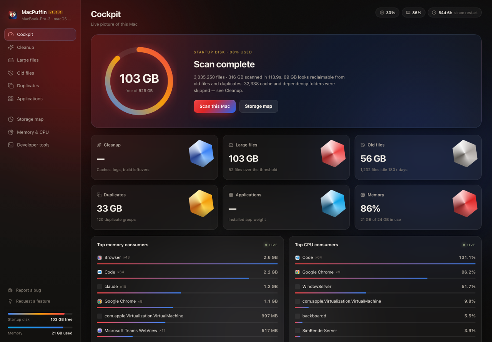
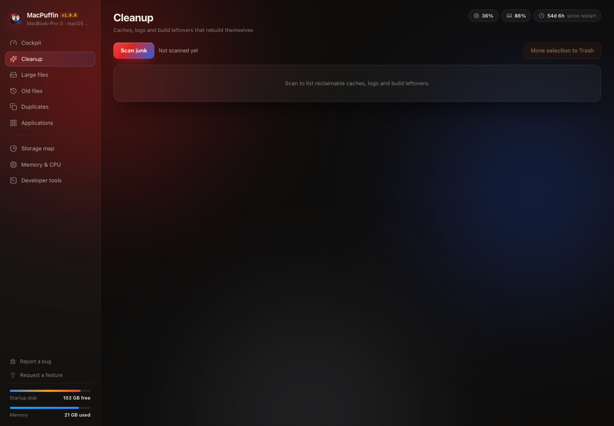
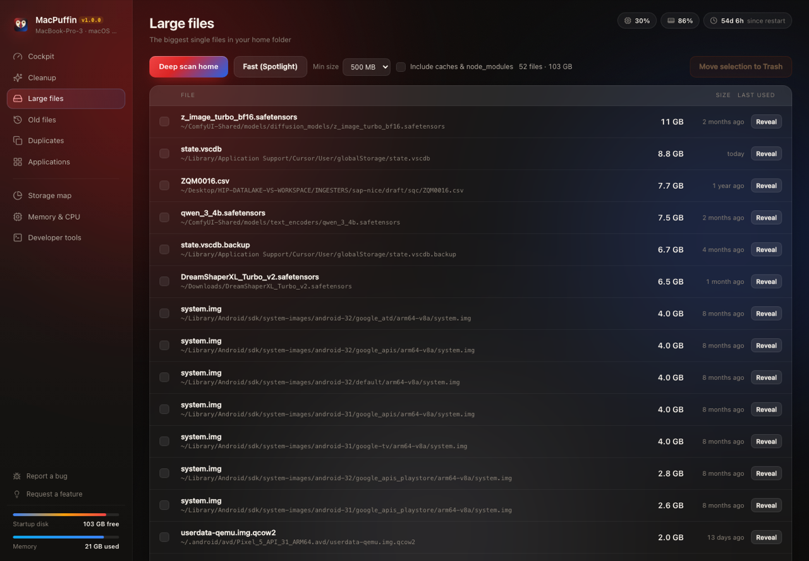
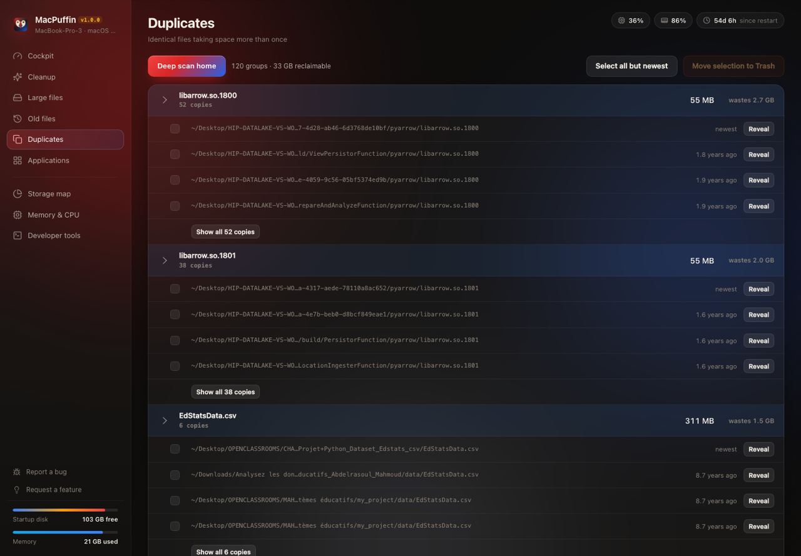
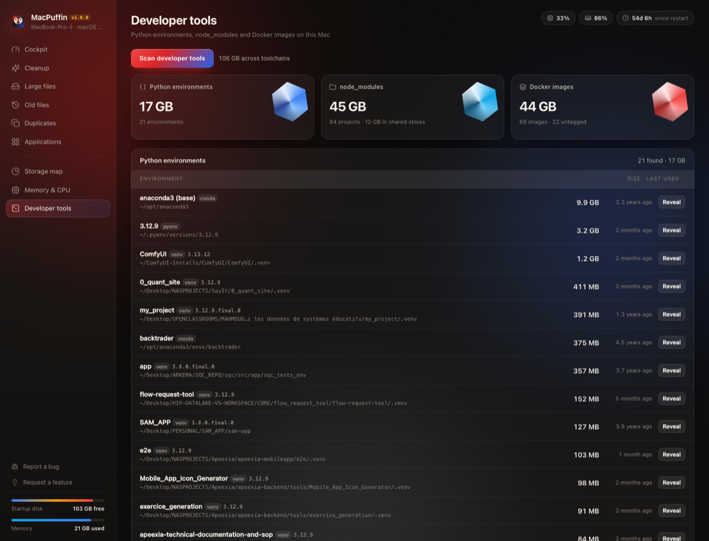
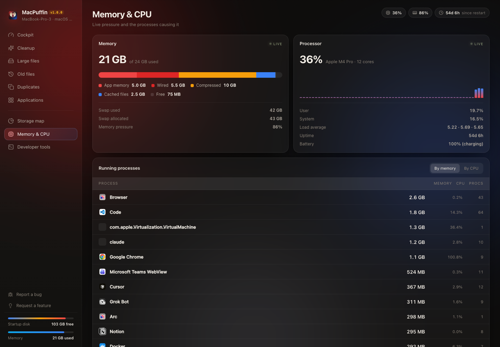

<div align="center">


# MacPuffin

**A local-only cockpit for your Mac — storage, memory, junk, large and old files, duplicates.**
Zero dependencies. No telemetry. Your files never leave the machine.

[](https://github.com/veraplot/MacPuffin/actions/workflows/ci.yml)
[](#tests)
[](#tests)
[](#zero-dependencies)
[](SECURITY.md#the-one-external-request)

[](https://developer.mozilla.org/docs/Web/JavaScript)
[](https://swift.org)
[](https://nodejs.org)
[](https://www.apple.com/macos/)
[](#compatibility)

[](LICENSE)
[](SECURITY.md)
[](RELEASE_NOTES.md)
[](CONTRIBUTING.md)
[](#architecture)

[](https://github.com/veraplot/MacPuffin/stargazers)
[](https://github.com/veraplot/MacPuffin/network/members)
[](https://github.com/veraplot/MacPuffin/issues)
[](https://github.com/veraplot/MacPuffin/commits)
[](https://github.com/veraplot/MacPuffin)
[](https://github.com/veraplot/MacPuffin)

[](https://www.linkedin.com/in/nassim-el-ghazaz-8bb141128/)

### [⬇︎ Download MacPuffin.dmg](https://github.com/veraplot/MacPuffin/releases/latest/download/MacPuffin.dmg)

[](https://github.com/veraplot/MacPuffin/releases/latest/download/MacPuffin.dmg)

[](https://github.com/veraplot/MacPuffin/releases/latest)
[](https://github.com/veraplot/MacPuffin/releases)
[](#compatibility)
[](https://github.com/veraplot/MacPuffin/releases/latest)

**Universal build — Apple Silicon and Intel. macOS 11 Big Sur or newer.**



</div>

---

## What this is

Disk-cleaning tools ask you to trust a signed binary with full access to your
files, an account, and a network connection. MacPuffin inverts that: it is a
**small, readable, dependency-free program that runs on your machine and only
on your machine**. A plain Node HTTP server bound to `127.0.0.1`, a static
front-end, and a 200-line native window around it.

It answers the questions you actually have when the disk fills up:

- Where did 800 GB go?
- What are the biggest files, and do I still need them?
- What have I not opened in a year?
- How many copies of the same file am I storing?
- What is eating my RAM right now?

Then it lets you act on the answer — safely, reversibly, and with a log of
everything it did.

> **On a real machine:** a 3 million file / 316 GB home folder scans in ~110
> seconds and surfaced 105 GB of caches, 56 GB of files untouched for 180+
> days, and 33 GB of duplicates. Reclaimed 76 GB on the first pass.

## Why it is different

| | MacPuffin | Typical cleaner |
|---|---|---|
| Dependencies | **0** | hundreds of transitive packages |
| Network access | **one** anonymous version check, off by a setting | telemetry, licence checks, updates |
| Deletion | move to Trash, reversible | often permanent |
| Audit trail | every action logged with errno | silent |
| Source | ~4,800 readable lines | closed binary |
| Price | free, MIT | subscription |
| Install | double-click, no installer | `.pkg` + helper daemon |

## Download

**[MacPuffin.dmg](https://github.com/veraplot/MacPuffin/releases/latest/download/MacPuffin.dmg)** — that link always points at the newest release.

1. Open the image and drag **MacPuffin.app** into Applications.
2. **Right-click the app → Open**, then confirm. Do this once.
3. Install Node if you do not have it: `brew install node`.

> **Why right-click → Open?**
> This build is signed ad-hoc, not with a paid Apple Developer ID, so it is not
> notarised. A plain double-click on a downloaded, non-notarised app is blocked
> by Gatekeeper. Right-click → Open is the supported one-time override. If macOS
> claims the app "is damaged", clear the quarantine flag instead:
>
> ```bash
> xattr -dr com.apple.quarantine /Applications/MacPuffin.app
> ```

Verify what you downloaded:

```bash
shasum -a 256 -c MacPuffin.dmg.sha256
```

### Or build it yourself

```bash
git clone git@github.com:veraplot/MacPuffin.git
cd macpuffin
./build-app.sh          # -> ~/Desktop/MacPuffin.app
./make-dmg.sh           # -> ./dist/MacPuffin.dmg
```

A build from source is not quarantined, so it opens on a normal double-click.
Needs the Xcode command-line tools (`xcode-select --install`).

Prefer the terminal?

```bash
npm start               # http://127.0.0.1:4780
NO_OPEN=1 PORT=5000 npm start
```

## Compatibility

One download covers every Mac Apple has shipped since 2011 that runs a current
OS. The Swift parts are built as a **universal binary** containing both an
`arm64` and an `x86_64` slice, so macOS picks the native one — no Rosetta, no
separate Intel build.

| | Supported | Notes |
|---|---|---|
| **Apple Silicon** (M1 – M4, Pro / Max / Ultra) | ✅ native arm64 | verified: Launch Services reports `LSArchitecture = arm64` |
| **Intel** (2011 – 2020, incl. T2) | ✅ native x86_64 | same binary, no Rosetta |
| **macOS 11 Big Sur → 26** | ✅ | `LSMinimumSystemVersion` is 11.0 |
| **macOS 10.15 Catalina and older** | ❌ | below the deployment target |
| **Node.js 20 / 22 / 24** | ✅ | CI runs the suite on all three |
| **APFS and HFS+ volumes** | ✅ | sizes come from block counts, not filesystem assumptions |
| **External / network volumes** | ✅ read | listed in the Storage map; deletion stays home-folder only |

Nothing in the analysis code is architecture-specific. Memory figures come from
`vm_stat`, and the page size is **parsed from its output** rather than assumed —
which matters, because it is 4 KB on Intel and 16 KB on Apple Silicon. Had it
been hard-coded, every Intel memory reading would be 4× wrong. CPU, disk and
process data come from `sysctl`, `df` and `ps`, whose output format is identical
on both architectures.

```bash
# Confirm the build you have is universal:
lipo -archs /Applications/MacPuffin.app/Contents/MacOS/MacPuffin
# -> x86_64 arm64
```

The release workflow refuses to publish a DMG whose app is missing either
slice, so a single-architecture build cannot reach users by accident.

Apple is winding down Intel support, so the shell also checks **which Node it
starts**. On a Mac with both an Intel Homebrew in `/usr/local` and a native one
in `/opt/homebrew`, picking the Intel binary would run the server under
Rosetta — slower, and exactly the situation Apple's deprecation notice warns
about. The architectures are read straight from each candidate's Mach-O header,
so no Xcode tools are needed, and a native build always wins. The Cockpit
reports what is actually running:

```bash
curl -s 127.0.0.1:4780/api/hardware | grep -o '"arch":"[^"]*"'
# -> "arch":"arm64"
```

**Tested on:** MacBook Pro (M4 Pro, macOS 26.5). The Intel slice is built and
verified in CI on every release, but has not been run on physical Intel
hardware — if you hit something there, please open an issue.

## Features

Every capability, version by version, is catalogued in **[RELEASE_NOTES.md](RELEASE_NOTES.md)**.

### Cockpit
Live disk gauge, memory pressure, CPU load, and the processes responsible —
refreshed every 2.5 s. One button scans everything.

### Cleanup


Known reclaimable locations with real sizes and a safety rating: user caches,
logs, Xcode DerivedData, simulator devices, npm / pnpm / Homebrew / pip /
Gradle caches, crash reports, saved application state, Trash.

Rows tagged **contents only** are folders macOS refuses to let *any* process
move — `mv` and Finder fail on them too. Those get their contents emptied while
the folder stays where the owning app expects it.

### Large files


Biggest single files, threshold from 100 MB to 5 GB. Two engines: a deep walk
of the home folder, or a near-instant Spotlight query for what is indexed.

### Old files
Files over 10 MB not opened or modified in 90 days to 2 years, using
`max(mtime, atime)` as the last-used date.

### Duplicates


Grouped by size, then confirmed with an MD5 fingerprint of the first and last
64 KB. Newest copy is marked; one click selects every redundant copy.

### Applications
Every app in `/Applications` with its size, version, and genuine last-used date
from Spotlight — not the file's `atime`.

### Storage map
Every mounted volume plus a home-folder breakdown that fills in progressively
as each folder is measured.

### Developer tools



Three toolchains, measured where they actually sit:

- **Python environments** — virtualenvs found by their `pyvenv.cfg`, conda
  environments, pyenv versions, and the interpreters on your `PATH`, each with
  its size, version and last use.
- **node_modules** — every project with dependencies installed, with a package
  count that counts scoped packages properly, plus the shared pnpm / npm / yarn
  stores that sit outside any project.
- **Docker images** — the local image store, largest first, with untagged
  layers marked and Docker's own reclaimable figure.

On a working developer machine this routinely finds more than the rest of the
app combined: **17 GB of Python environments, 45 GB of node_modules and 44 GB
of Docker images** on the Mac this was built on.

### Memory & CPU


Activity-Monitor-style memory split (app / wired / compressed / cached / free),
swap, load average, a CPU history sparkline, and the full process list
aggregated per app bundle.

## When something breaks

**Report a bug** and **Request a feature** sit at the bottom of the sidebar and
open a pre-filled issue on GitHub.

If MacPuffin hits an error it records a crash report locally and shows a
banner. **See report** displays the entire thing before you decide anything;
**Share the crash report** opens a GitHub issue with it filled in. Nothing is
transmitted from the app — you review the text and press submit yourself, and
the issue is public once you do.

The report contains the error, the stack, and your Mac's specification (model,
chip, architecture, memory, macOS build, Node version). It does not contain
file names or scan results, and before the report is even displayed the home
folder is rewritten to `~` and your account name is removed.

Crash reports live in `~/Library/Logs/MacPuffin/crashes.json`.

## How it reads the system

Everything comes from stock macOS tools and the filesystem:

| Tool | Provides |
|---|---|
| `df -k` | volume capacity |
| `vm_stat` + `sysctl` | memory pages, swap, hardware facts |
| `ps` / `top` | processes, aggregated per app bundle |
| `mdfind` / `mdls` | fast large-file search, real app last-used dates |
| `pmset` | battery and thermal throttling |
| `readdir` / `lstat` | the deep scan walk |

File sizes use blocks actually on disk (`st.blocks * 512`), so sparse files and
iCloud placeholders are never overcounted.

## Safety model

**Nothing is ever erased.** Every delete is `FileManager.trashItem` — Finder's
own API — so items land in `~/.Trash` with working **Put Back**. Space is only
reclaimed when you empty the Trash, and the UI says so with a running total
instead of pretending the disk got smaller.

Three guards run before any filesystem call:

1. Paths outside your home folder are refused. The one exception is an app
   bundle directly in `/Applications`, so uninstalling works;
   `/System/Applications` stays blocked.
2. A protected list is refused even inside home: `~`, `~/Documents`,
   `~/Desktop`, `~/Downloads`, `~/Pictures`, `~/Movies`, `~/Music`,
   `~/Library`. Paths are resolved first, so `../` tricks are caught.
3. macOS-owned container folders are refused with an explanation pointing at
   the operation that does work.

Every move, refusal and failure is appended to
`~/Library/Logs/MacPuffin/macpuffin.log`:

```
2026-09-19T06:57:31.152Z INFO  trash.moved {"path":"…/sub","dest":"…/.Trash/sub","isDir":true,"size":null}
2026-09-19T06:57:31.152Z INFO  empty.done  {"dir":"…","entries":2,"moved":2,"failed":0,"freed":3,"unsized":1}
```

## Security

The full threat model lives in **[SECURITY.md](SECURITY.md)**. The short
version:

### Zero dependencies

No `dependencies`, no `devDependencies`, no `node_modules`, no lockfile.
Nothing is fetched from a registry, so there is no supply chain to attack.
Every import is a Node builtin:

```
node:path  node:os  node:fs  node:fs/promises  node:http
node:crypto  node:child_process  node:url  node:util
```

### No outbound network path from the server

There is no `fetch`, `http.request`, `net.connect`, `dgram`, WebSocket or DNS
call anywhere in the server. The socket binds `127.0.0.1` explicitly. Pages are
served with a Content Security Policy whose `connect-src 'self'` leaves no
permitted channel to any outside host, even in the presence of injected
content. Your files never leave this machine.

The native shell makes **one** external request per launch — an anonymous
`GET https://api.github.com/repos/veraplot/MacPuffin/releases/latest` — to tell
you when a newer version is out. No identifiers, no usage data, no body, a
6-second timeout, every failure ignored, and nothing is ever auto-downloaded.
Turn it off for good with:

```bash
defaults write local.macpuffin.app disableUpdateCheck -bool YES
```

Full detail in [SECURITY.md](SECURITY.md#the-one-external-request).

### No shell, so no injection

Commands run through `execFile` with an argv array — never `exec`, never
`shell: true`, never string concatenation. A filename containing `; rm -rf ~`
is one literal argument. The complete set of binaries the app may invoke:
`df`, `vm_stat`, `sysctl`, `ps`, `top`, `pmset`, `mdfind`, `mdls`, `open`,
`osascript` (one fixed literal), `mptrash`.

### CI enforces all of it

The `audit` job fails the build if a non-builtin import, an outbound network
primitive, a shell invocation, or a non-loopback bind is ever introduced.

### Known limits, stated plainly

The app is unsandboxed and reads your whole home folder — that is the job. It
is ad-hoc signed, not notarised. `Empty Trash` is irreversible. The local
server is reachable by any process running as your user.

## Tests

108 tests, no framework — `node:test` from the standard library.

```bash
npm test                # run the suite
npm run test:coverage   # with coverage thresholds (fails under 70%)
```

| File | Covers |
|---|---|
| `tests/unit.test.js` | byte formatting, top-N heap, concurrency pool, every safety rule, file classification, logging |
| `tests/scan.test.js` | real fixture tree: deep scan, duplicate detection, bundle handling, trash + empty round-trips |
| `tests/server.test.js` | boots the real server: CSP headers, CSRF guard, protected-path refusals, path traversal, live system readings |
| `tests/system.test.js` | the real machine: memory split, page-size handling, CPU, process aggregation, volumes, battery |
| `tests/scanners.test.js` | junk, applications, home map, Spotlight, icon extraction, environment discovery, crash records, bulk and fallback trashing |

Current coverage of `lib/`: **92.0% lines, 76.4% branches, 88.2% functions**. The
build fails below 90 / 72 / 85, so coverage cannot quietly rot.

CI runs the suite on macOS against Node 20, 22 and 24, builds the `.app` and
the DMG, and verifies the signature on every push. The coverage thresholds run
separately on Node 22, because the flags that enforce them do not exist in
Node 20 — the app itself runs fine there, only the test tooling needs 22.

## Architecture

```
server.js          HTTP + SSE routes, static serving, CSP, CSRF guard
lib/system.js      df / vm_stat / ps / top / pmset parsing
lib/scan.js        one tree walk feeding every analyzer
lib/trash.js       trashItem helper, protected-path list, container rules
lib/log.js         structured log to ~/Library/Logs/MacPuffin
lib/util.js        byte formatting, top-N heap, concurrency pool
public/            index.html · style.css · app.js   (no build step)
native/            MacPuffin.swift (window) · mptrash.swift (trash helper)
                   icon.png (master) · icon-prompt.txt · compose-icon.py
tests/             node:test suites
build-app.sh       compiles universal Swift binaries, renders the icon, assembles MacPuffin.app
make-dmg.sh        packages the app into a verified, checksummed DMG
```

A single walk produces large files, old files, duplicate candidates, category
totals and folder totals at once — the expensive part is the `lstat`, so doing
it once and fanning out in callbacks is what keeps a 3 M file scan near two
minutes. Progress streams to the UI over Server-Sent Events and the walk stops
when the client disconnects.

Fast mode skips the churn directories the Cleanup view already owns
(`~/Library/Caches`, `~/Library/Developer`, `~/.cache`, `node_modules`, `.git`,
`Pods`, `.venv`) and reports how many it skipped. Tick **Include caches &
node_modules** for a full walk.

## Design

A red-to-blue signature over a graphite base, with the amber of a puffin's beak
kept as the third accent. Every colour is a token at the top of
`public/style.css` (`--red --crimson --blue --azure --indigo --amber --gold
--stone --slate`), plus two reusable gradients — `--grad-brand` for the brand
mark, primary action and progress surfaces, and `--grad-meter` for gauges that
run blue when there is room and red when there is not. The app re-skins by
editing that one block.

### The icon

The puffin was generated with Gemini from the prompt kept at
`native/icon-prompt.txt` — flat vector mascot, Apache/CNCF register, brand hex
values written into the prompt. `native/compose-icon.py` keys out the flat
background and rebuilds the tile with the app's own palette: a graphite
squircle lit red from the top left and blue from the bottom right, the same
device as the app's background. The committed `native/icon.png` is the 1024
master; the build only slices it, so no Chrome and no Python are needed to
build the app.

Icons are [Lucide](https://lucide.dev) (ISC), inlined as an SVG sprite — no
package, no network request, and they inherit the row's colour.

| View | Icon | | View | Icon |
|---|---|---|---|---|
| Cockpit | `gauge` | | Duplicates | `copy` |
| Cleanup | `sparkles` | | Applications | `layout-grid` |
| Large files | `hard-drive` | | Storage map | `chart-pie` |
| Old files | `history` | | Memory & CPU | `cpu` |

## Notes

- Some folders (`~/Library/Mail`, Photos internals) need Full Disk Access.
  Without it the walk silently skips them; grant it in System Settings →
  Privacy & Security if you want them counted.
- iCloud Drive (`~/Library/Mobile Documents`, `~/Library/CloudStorage`) is
  skipped on purpose: dataless placeholders would report sizes that are not
  actually on this disk.
- Scan results are cached in the server process, so reloading the page restores
  the last scan instead of re-running it.

## Contributing

Issues and pull requests are welcome. Keep the two rules that make this project
what it is:

1. **No dependencies** — not runtime, not development, not build.
2. **No outbound network calls from the server.** Your files are read and
   analysed entirely on your machine. The only external request in the whole
   project is the anonymous version check in the native shell, described in
   [SECURITY.md](SECURITY.md#the-one-external-request); CI holds it to a
   host allowlist.

CI enforces both.

## License

[MIT](LICENSE) © Veraplot

<div align="center">
<sub>Built by <a href="https://www.linkedin.com/in/nassim-el-ghazaz-8bb141128/">Nassim El Ghazaz</a> · <a href="https://github.com/veraplot">Veraplot</a></sub>
</div>
